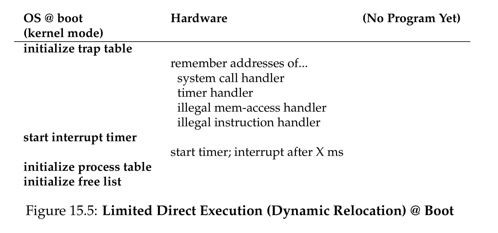
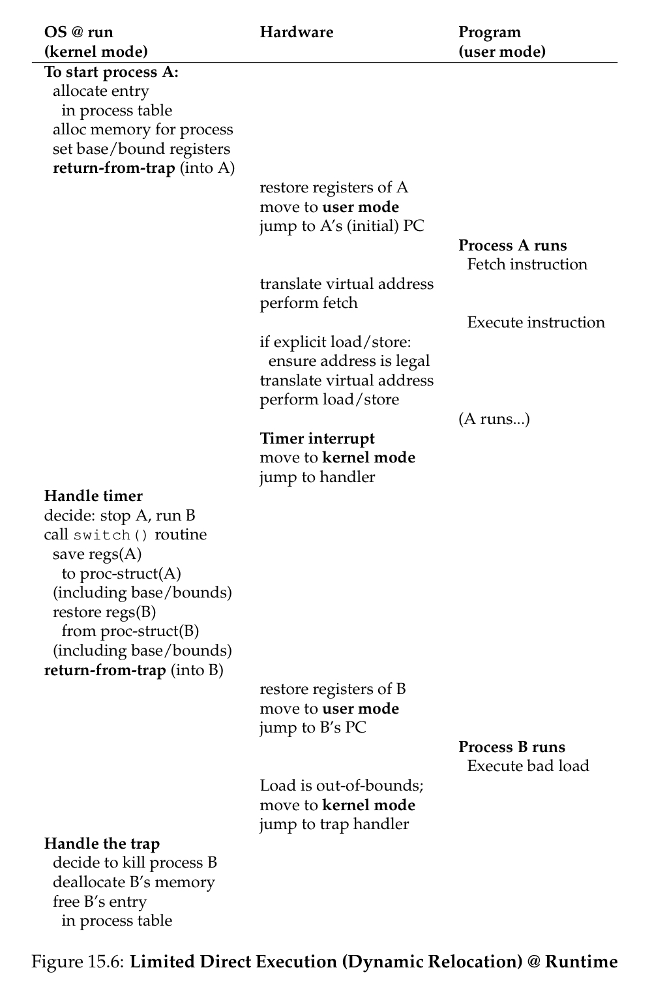

# Mechanism: Address Translation

## The Problem: Efficient and Flexible Memory Virtualization

How to efficiently and flexibly virtualize memory?

- **virtualize efficiently**
- provide **flexibility**
- maintain **control**

## The Generic Technique

- **hardware-based address translation** (**address translation** for short)
- change the **virtual address** provided by the instruction to a **physical address**
- **hardware alone** cannot virtualize memory; the **OS** must get involved to set up the hardware
- the **OS** must **manage memory**
  - keep track of which location is **free** and **in use**

## Assumptions

1. user's address space must be placed **contiguously** in physical memory
2. size of the address space is not too big — less than the size of **physical memory**
3. each address space is exactly the **same size**

## Dynamic (Hardware-based) Relocation (Address Translation)

### Base and Bounds (Dynamic Relocation)

- need **2 hardware registers** within each CPU:
  - **base** register
  - **bounds** (**limit**) register
- program is compiled as if it is loaded at address **zero**
- when a program starts running, the **OS** decides where in **physical memory** it should be loaded
  - sets the **base register** to that value
- for any memory reference generated by the process, it is translated as:

  `physical address = virtual address + base`

### Why It’s “Dynamic”

- **dynamic** because the relocation of the address happens at **runtime**
- we can move address spaces even **after the process has started**

### Bounds Checking

- **bounds register** makes sure that all addresses generated by the process are **legal**
  - processor checks first that the memory reference is within **bounds** (if it's legal)
  - if a process generates a virtual address greater than the **bounds** (or one that's **negative**), the CPU will raise an **exception**
- **base** and **bounds** registers are hardware structures on the chip per CPU in the **MMU**

## Hardware Support: A Summary

- **privileged mode**
  - needed to prevent **user-mode** processes from executing **privileged operations**
- **base/bounds registers** in per CPU **MMU**
  - need pair of registers per CPU to support **address translation** and **bounds checks**
- ability to translate **virtual address** and check if within **bounds**
- **privileged instructions** to update **base/bounds**
  - OS must be able to set these values before letting a user program run
- **privileged instructions** to register **exception handlers**
  - OS must be able to tell hardware what code to run if exception occurs
- ability to raise **exceptions**
  - when processes try to access **privileged instruction** or **out-of-bounds** memory

## Operating System Issues

### Aside: Moving an Address Space

Note that the OS can move an address space of a process from one location to another easily:

1. stop the process
2. copies the address space fro the current location to the new location
3. updates the save base register

### Core OS Responsibilities

- **memory management**
  - need to allocate memory for new processes
  - reclaim memory from terminated processes
  - manage memory via **free list**
- **base/bounds management**
  - must set **base/bounds** upon **context switch**
- **exception handling**
  - code to run when exception arise (likely just terminate it)

## Limited Direct Execution (Dynamic Relocation) at Boot

## Limited Direct Execution (Dynamic Relocation) at Runtime

