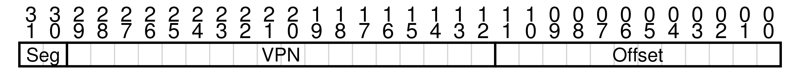
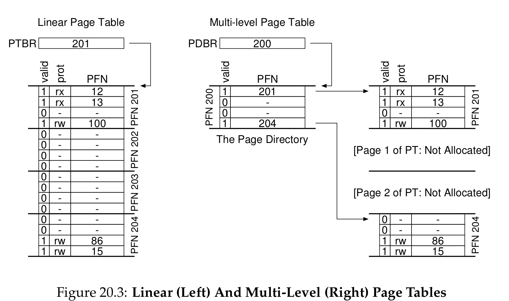
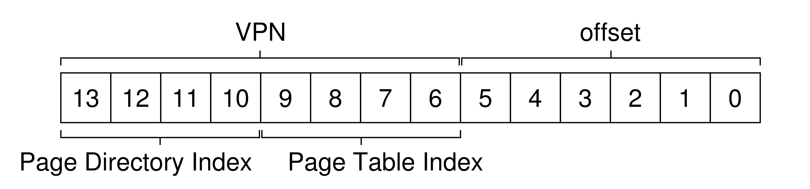
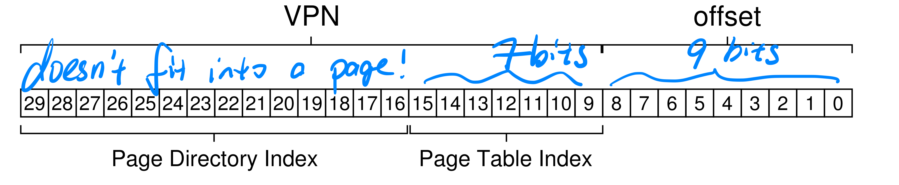
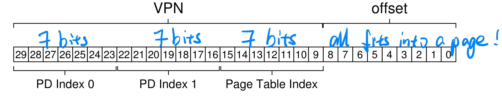

# Paging: Smaller Tables

## The problem
- Page tables are too big (e.g. linear page tables).
- How to make page tables smaller?

## Simple solution: bigger pages
- lead to **internal fragmentation**
- not a solution

### Aside: multiple page size
- by default, a small page is used
- but when requested, a single large page can be used for a portion of the address space
- for user to place a **frequently-used** and **large** data structure in there
- reduce pressure on the **TLB**: only consume a single **TLB entry**!
- common approach for database management systems

## Hybrid approach: paging and segments
- most of linear page table is unused, full of invalid entries, such a waste
- instead of having a single page table for the entire address space, have one per logical segment (**code**, **heap**, **stack**)
- **base register** hold the physical address of the page table of that segment.
- **bounds register** indicate the end of the page table (# of valid pages it has)

### Diagram
- 

### On a TLB miss
1. `SN = (vaddr & SEG_MASK) >> SN_SHIFT`
2. `VPN = (vaddr & VPN_MASK) >> VPN_SHIFT`
3. `AddressOfPTE = Base[SN] + (VPN * sizeof(PTE))`

### Notes
- the **bounds registers** are used to validate page table lookup

### Problems
- not quite flexible
- **external fragmentation**

## Multi-level page tables
- turns the linear page table into a tree structure

### Idea
- chop up the page table into page-sized units
- if entire page of **PTEs** is invalid, don't allocate that page of the page table at all
- to track whether a page of page table is valid, use **page directory**
- **page directory** can be either:
  - tell where a page of the page table is
  - or tell that the entire page of the page table contains no valid pages
- **Page directory** consists of multiple **page directory entires (PDE)**
  - **valid bit**: means at least one of the pages of the page table is valid
  - **PFN**: similar to the one in **PTE**

### Diagram
- 

### Advantages
1. only allocate page table space in proportion to the amount of address space used
2. easier to allocate space for page table: OS just find the next available physical page frame

### Disadvantages
1. On a **TLB miss**, 2 loads from memory is required to get the right translation
2. complexity

## How to virtual address is translated?
### Diagram
- 

### Three steps
1. `PDEAddr = PageDirBase + (PDIndex * sizeof(PDE))`
2. `PTEAddr = (PDE.PFN << SHIFT) + (PTIndex * sizeof(PTE))`
3. `PhysAddr = (PTE.PFN << SHIFT) + offset`

## More than two levels
- goal of multi-level page tables: make each piece of the page table fit within a single page
  - why: page-sized pieces avoid needing special contiguous multi-page allocation
- what if page directory gets too big?

### Two level
- 

### Three level
- 

## Inverted page tables
- Instead of having one page table per process, have a single page table
- an entry for each physical page
- each entry tells us which process is using this page, and the **VPN** that maps to this physical page

## Swapping the page table to disk
- we have assumed that page tables resides in kernel-owned **physical** memory
- the reality: page tables are placed in kernel-owned **virtual** memory
- swap part of a page table to disk
