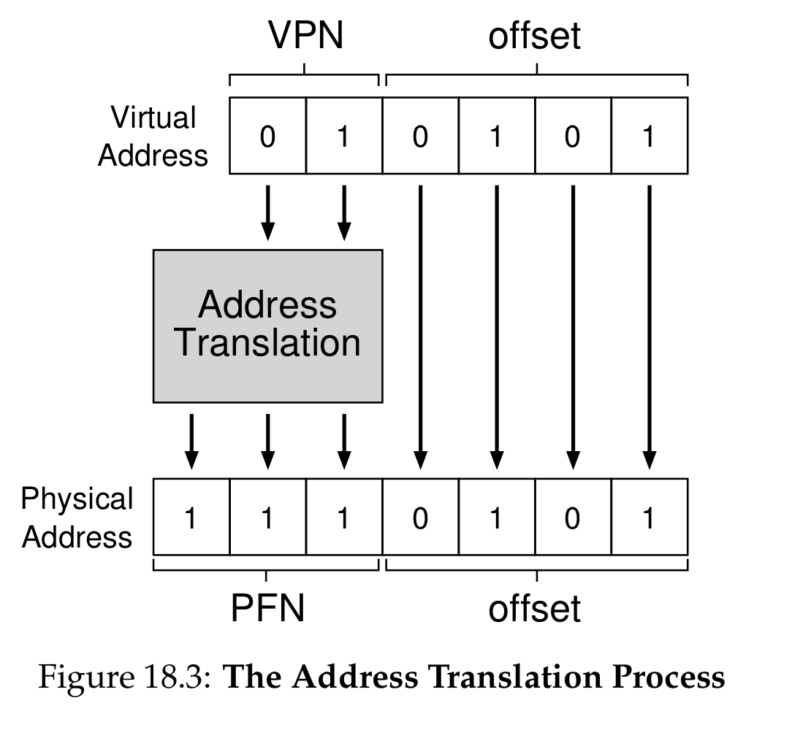
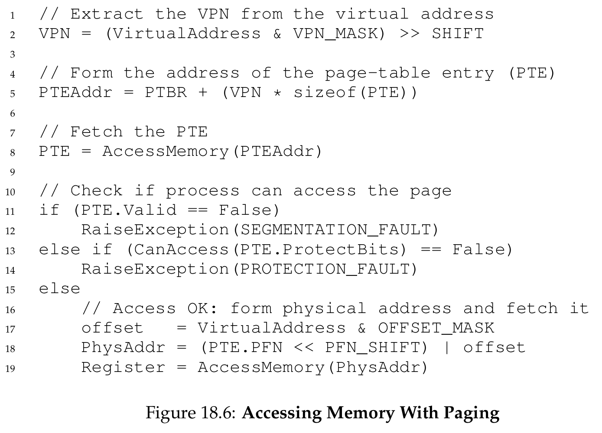

# Paging: Introduction

## Two common approaches
1. Chop into **variable-sized** pieces -> **fragmentation**
2. Chop in to **fixed-sized** pieces -> **paging!**

## The problem
- How to virtualize memory with **pages** to reduce fragmentation of **segmentation**?

## Overview
- **Virtual address space** consists of multiple **pages**.
- **Physical memory** also consists of multiple **page frames**.
- Pages of the virtual address space can be placed at different locations in physical memory.
- Very flexible: no assumption about how a process uses the address space.
- Simplicity for **free-space management**: just use a **free list** and find enough number of requested pages, done.
- **Page table**: store address translations for each virtual pages; maps virtual pages to physical page frames.
- Page table is a **per-process** structure.

## Address translation example
- `movl <virtual address>, %eax`
- Split into two components: **VPN** and **offset** within the page.
- **PFN** = **physical frame number**
- 
- The **offset** stays the same, because virtual page and physical page frame are the same size.

## Where are page tables stored?
- Page tables can get very large.
- Thus not kept in any special on-chip hardware in the **MMU**.
- Instead, kept the page table for each process in memory somewhere (in **OS**'s own address space).

## What's actually in the page table?
- Map **virtual page numbers** to **physical frame numbers**.

### Linear page table
- OS index page table with **VPN**, gets the **PTE**, and gets the **PFN**.

### Bits in the PTE
- **valid**: indicate whether the translation is valid (**unused pages** will be marked as invalid)
- **protection bits**: whether the page could be **read**, **write**, or **executed**
- **present bit**: whether the page is in **physical memory** or on **disk**
- **dirty bit**: whether the page has been modified since it was brought into memory
- **reference bit** (aka **accessed bit**): whether a page has been accessed (critical during **page replacement**)
- **mode bit**: whether **user-mode** processes can access the page

## Paging: also too slow
- The initial memory referencing protocol with paging
- 
- One layer of indirection to fetch **PTE** first: extra memory reference is too slow!
