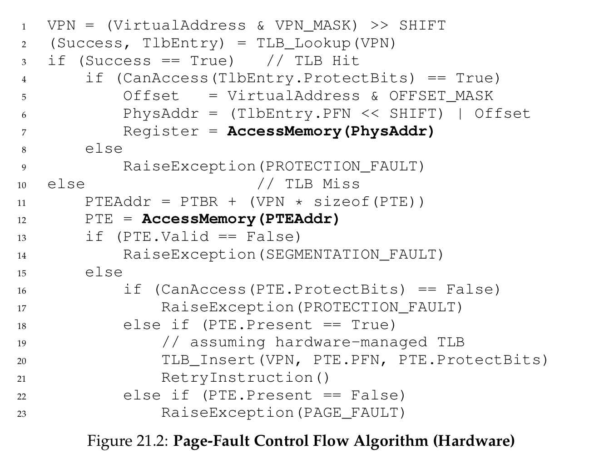
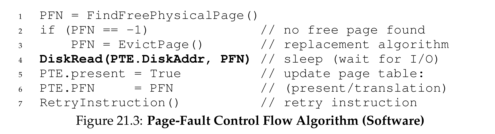

# Beyond Physical Memory: Mechanisms

## The problem
- How to go beyond **physical memory**
- How the OS makes use of **hard disk drive** to transparently provide the illusion of a large **virtual address space**

## Swap Space
- **swap space**: reserved space on the disk for moving pages back and forth
- OS can read and write to the **swap space** in page-sized units
- using **swap space** allows the system to pretend that memory is larger than it actually is

## The present bit
- when the hardware (or OS) looks in the **PTE**, the page may not present in **physical memory**
- hardware (or OS) know this by looking at the **present bit** in **PTE**:
  - `1`: page is present in **physical memory**
  - `0`: page is not in memory but rather on disk
- **Page fault**: accessing a page that is not in **physical memory**
- Upon a **page fault**, the **page-fault handler** will be ran

## The Page Fault
- in both hardware-managed **TLBs** or software-managed **TLBs**, it's always the OS's **page-fault handler** to handle the page fault

### How will the OS know where to find the desired page?
- use some bits in the **PTE**

### The Page-in process
- when OS receives a **page fault**, looks in the **PTE** to find the disk address
- then issues the request to disk to fetch the page into memory
- when disk I/O completes, OS will update the page table to mark the page as **present**, update the **PFN** field of the **PTE**
- retry the instruction
  - may generate a **TLB miss**
  - update **TLB** and try again
  - finally find the translation in **TLB** and done!

### While disk I/O is in flight
- while disk I/O is in flight, the process will be in **blocked** state
- OS is free to run other **ready** processes while the page fault is being serviced

## What if memory is full?
- Page-out some pages to make room
- **page-replacement policy**: very important for program's speed

## Page fault control flow
### What the hardware does during translation
- 

### what the OS does upon a page fault
- 

## When replacements really occur
- OS will keep a small portion of memory free more proactively
- **high watermark** and **low watermark** to help decide when to start evicting pages from memory
- when OS notices there are fewer than `LW` pages available, a background thread will run to evicts pages until there are `HW` pages available
- the background thread is called the **swap daemon** or **page daemon**

### Performance optimizations
- e.g. cluster or group a number of pages and write them out at once
