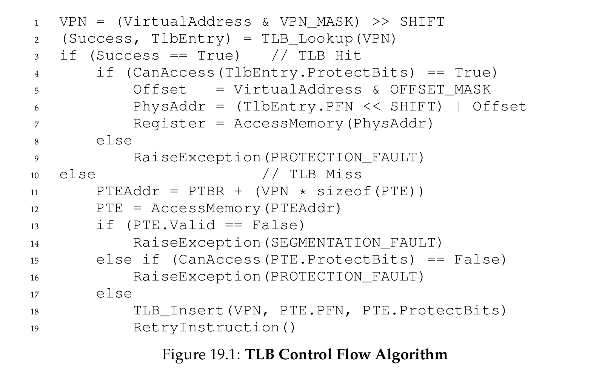
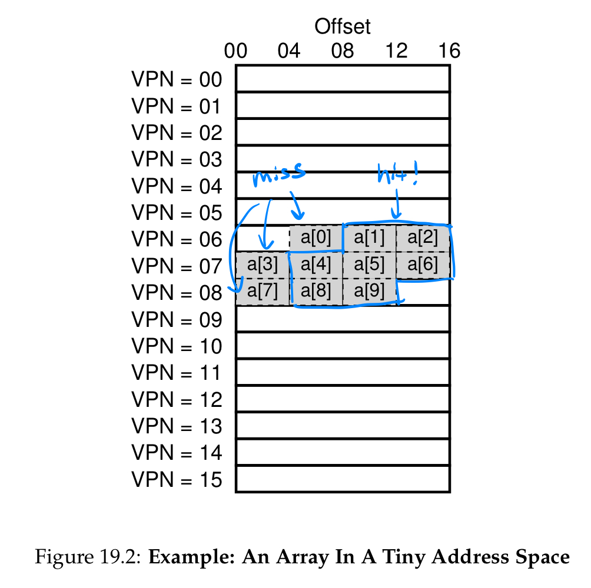

# Paging: Faster Translation (TLBs)

## The problem
- How to speed up address translation?
- What hardware is required?
- What OS involvement is required?

## Key concepts
- **TLB** = **translation-lookaside buffer**
- **TLB** is part of **MMU**
- hardware cache of popular **virtual-to-physical** address translations

## TLB basic algorithm
- assume linear **page table** and **hardware-managed TLB**
- 

## Example: Accessing an array
- Code:
  - `for (int i = 0; i < 10; i++) sum += a[i];`
- Diagram:
  - 
- **TLB** improves performance due to:
  - spatial locality
  - temporal locality
- page size also matters:
  - the bigger the page, the fewer **TLB misses** would have

## Who handles the TLB miss?

### In the old days: hardware-managed TLB
- hardware would handle **TLB miss** entirely
- hardware has to know exactly:
  - where the **page tables** are located in memory
  - their exact format
- on a miss:
  - the hardware would traverse the page tables
  - find the **PTE**
  - update the **TLB**
- called **hardware-managed TLB**

### In the modern days: software-managed TLB
- on a miss:
  - hardware raises an exception
  - invoke an **OS trap handler**
- the handler will:
  - lookup the translation in the page table
  - use privileged instructions to update the **TLB**
  - returns
- the hardware retries the instruction

### Details
- `return-from-trap` instruction is a bit different:
  - **Type1**: resume execution at the instruction **after** the trap (normal handlers)
  - **Type2**: resume execution at the instruction that **caused** the trap (will let hardware retry the failed instruction, resulting in a **TLB hit**)
  - Depending on how trap was caused, hardware must save a different **PC** when trapping

- when running **TLB miss-handling** code, OS needs to ensure no infinite chain of **TLB misses**
  - solution1: put this handler in physical memory (unmapped, not subject to address translation)
  - solution2: hardcode some entries in the **TLB** for permanently-valid translation, and use some slots for the handler itself

- Advantage:
  - flexibility (for the **OS**)
  - simplicity (for the hardware)

## TLB Contents: what's in there?
- fully associative cache
- `[VPN] [PFN] [other bits]`

### Other bits
- **valid bit**: whether the entry has a valid translation
- **protection bits**: how page can be accessed
- **address-space identifier (ASID)**, **dirty**, and so on

## TLB issue: context switches
- the translation in the **TLB** for the last process are not meaningful to the new process
- How to manage **TLB contents** on a context switch?

### solution1: flush the TLB on context switches
- sets all **valid bits** to 0
- high overhead (especially when the **OS** switches between processes frequently)

### solution2: address space identifier (ASID) in TLB entries
- just like **PID**, but fewer bits
- **ASID** marks which translation belongs to which process, thus no confusion

#### Aside: Page sharing
- two **TLB entires** for 2 different processes point to the same physical page.
- may arise due to sharing a page (e.g. a code page)

## Issue: replacement policy
- How to design **TLB replacement policy**? which entry should be replaced?
- **LRU**
- random

## Summary
- **TLB coverage**
- Physically-indexed cache vs. virtually-indexed cache
