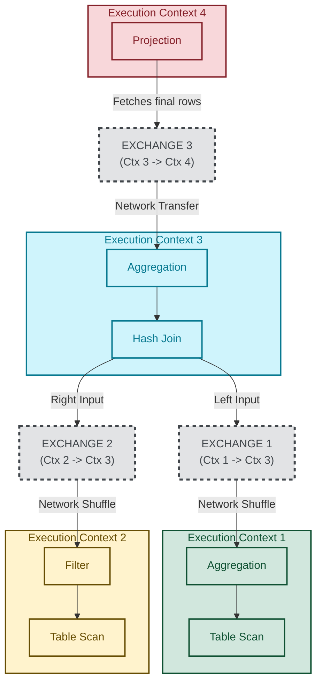

# Exchange Operator

Traditional iterator model:
- Does not take advantage of parallel execution
- Has high tuple-at-a-time function call overhead

Exchange Operator:
- Introduces parallelism in a modular way
- Provides clean physical algebra for parallel plans

## Core Idea

Imagine this simple sequential plan:
```
Projection
    |
Filter
    |
TableScan
```

How do we run `Filter` and `TableScan` in parallel (while keeping the iterator interface)?

Insert a `Exchange` operator:
```
Projection
    |
Filter
    |
Exchange
    |
TableScan
```

The `Exchange` operator internally starts another thread that runs the `TableScan` and pushes produced tuples into a queue.
```
Thread 1: Filter consumes tuples
Thread 2: TableScan produces tuples
Queue:   connects them
```

## Producer/Consumer Queue

The exchange operator is basically a producer/consumer queue.

```
Thread A:
    Filter
      |
    Exchange consumer side

Thread B:
    Exchange producer side
      |
    TableScan
```




