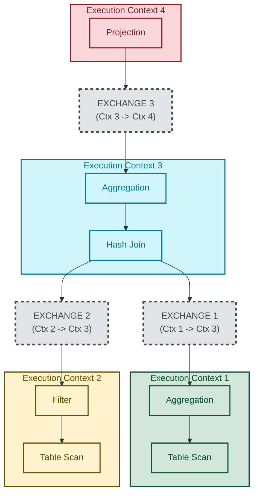

# Exchange Operator

Traditional iterator model:
- Does not take advantage of parallel execution
- Has high tuple-at-a-time function call overhead

Exchange Operator:
- Introduces parallelism in a modular way
- Provides clean physical algebra for parallel plans

## Core Idea

Imagine this simple sequential plan:
```
Projection
    |
Filter
    |
TableScan
```

How do we run `Filter` and `TableScan` in parallel (while keeping the iterator interface)?

Insert a `Exchange` operator:
```
Projection
    |
Filter
    |
Exchange
    |
TableScan
```

The `Exchange` operator internally starts another thread that runs the `TableScan` and pushes produced tuples into a queue.
```
Thread 1: Filter consumes tuples
Thread 2: TableScan produces tuples
Queue:   connects them
```

## Producer/Consumer Queue

The exchange operator is basically a producer/consumer queue.

```
Thread A:
    Filter
      |
    Exchange consumer side

Thread B:
    Exchange producer side
      |
    TableScan
```

## Multiple `Exchange` Operators

When there are multiple `Exchange` operators in a query plan, the subtree that is under each `Exchange` gets its own execution context:



Each `Exchange` operator exchanges data between execution contexts (via producer and consumer queue), hence the name.

## Type of `Exchange` Operators

Think of query plan as a dataflow graph:
- Normal operators transform data:
  - `Scan -> Filter -> Join -> Aggregte`
- Exchange operators route data:
  - gather
  - merge
  - shuffle
  - broadcast
  - partition

### Gather exchange

The gather exchange merges all output streams into one stream.

Query:
```sql
SELECT * FROM users WHERE age > 30;
```

Plan:
```
Filter(age > 30)
    |
GatherExchange
   /      |      \
Scan    Scan    Scan
```

### Broadcast exchange

One input is copied to many workers.

Query:
```sql
SELECT * FROM huge_orders o JOIN small_users u ON o.user_id = u.id;
```

Plan:
```
small_users
    |
BroadcastExchange
   /       |       \
Worker1 Worker2 Worker3
```

In this plan, `small_users` is small, while `huge_orders` is huge.
To perform this `JOIN`, we partition the `huge_orders` table into 3 partitions and scan them in parallel.
Then broadcast the `small_users` table to every worker scanning `huge_orders`, then each worker can do a local `JOIN`.

### Re-partition exchange

Many streams to many streams by key.

### Round-robin exchange

Distribute rows evenly. Used for load balancing.

```
row 1 -> worker 0
row 2 -> worker 1
row 3 -> worker 2
...
```

### Merge exchange

Combine sorted streams while preserving order. Used when order must be preserved.
